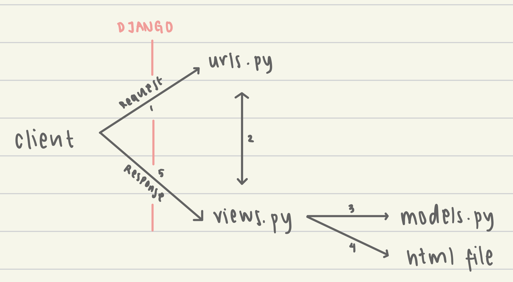

Nama    : Nazkya Raahiil Ramandha
NPM     : 2206030893
Kelas   : PBP F

link adaptable: https://tokobuahnazkya.adaptable.app

1. Jelaskan bagaimana cara kamu mengimplementasikan checklist di atas secara step-by-step (bukan hanya sekadar mengikuti tutorial).
-Membuat repository baru di github dan clone ke dalam laptop saya
-Membuat project django baru di folder tersebut
-Menambahkan aplikasi main ke dalam project
-Mengisi file main.html dengan isi apa yang saya inginkan di web
-Menambahkan class Item di file models.py dan menambahkan variabel baru seperti amount, price, name, lalu saya migrate modelnya
-Membuat fungsi show_main di file views.py
-Membuat routing dari urls pada main lalu di-route ke urls project saya
-Membuat app baru di adaptable dan melakukan deployment

2. Buatlah bagan yang berisi request client ke web aplikasi berbasis Django beserta responnya dan jelaskan pada bagan tersebut kaitan antara urls.py, views.py, models.py, dan berkas html.

Berikut adalah kaitan antara urls.py, views.py, models.py, dan berkas html:
-urls.py adalah file yang berisi daftar URL yang tersedia di aplikasi Django.
-views.py adalah file yang berisi fungsi yang menangani request dari client.
-models.py adalah file yang berisi model data yang digunakan oleh aplikasi Django.
-berkas html adalah file yang berisi tampilan aplikasi Django.

3. Jelaskan mengapa kita menggunakan virtual environment? Apakah kita tetap dapat membuat aplikasi web berbasis Django tanpa menggunakan virtual environment?
-> Kita menggunakan virtual environment untuk mengisolasi proyek Python kita dari proyek Python lainnya. Hal ini berguna untuk beberapa alasan, di antaranya:

a. Mencegah konflik paket: Paket Python bisa saling bergantung. Dua proyek Python yang menggunakan versi yang berbeda dari paket yang sama dapat menyebabkan konflik. Virtual environment akan memastikan bahwa setiap proyek Python menggunakan paketnya sendiri.
b. Menjaga kemurnian proyek: Jika kita memiliki proyek Python yang besar dan kompleks, maka kita mungkin ingin menjaga kemurnian proyek tersebut. Virtual environment akan memungkinkan kita untuk menginstal paket yang hanya diperlukan untuk proyek tersebut.
c. Mempermudah pengembangan: Virtual environment membuat proses pengembangan lebih mudah karena kita dapat dengan mudah beralih antara proyek Python yang berbeda.
Bisakah kita membuat aplikasi web berbasis Django tanpa menggunakan virtual environment?

Kita tetap dapat membuat aplikasi web Django tanpa menggunakan virtual environment tetapi hal ini tidak disarankan karena akan meningkatkan risiko konflik paket dan masalah lainnya.

4. Jelaskan apakah itu MVC, MVT, MVVM dan perbedaan dari ketiganya.
-> MVC, MVT, dan MVVM adalah tiga pola desain (design pattern) yang populer untuk aplikasi web. Pola desain ini membagi aplikasi web menjadi beberapa bagian yang berbeda, sehingga memudahkan pengembangan dan pemeliharaan aplikasi.

a. MVC (Model-View-Controller) adalah pola desain yang paling populer untuk aplikasi web. Pola desain ini membagi aplikasi web menjadi tiga bagian utama:
Model: Model bertanggung jawab untuk menyimpan data dan logika bisnis.
View: View bertanggung jawab untuk menampilkan data kepada pengguna.
Controller: Controller bertanggung jawab untuk menerima input dari pengguna dan mengaktifkan model dan view.
b. MVT (Model-View-Template) adalah pola desain yang mirip dengan MVC tetapi tidak memiliki controller. Dalam pola desain MVT, view dan controller digabungkan menjadi satu.
c. MVVM (Model-View-ViewModel) adalah pola desain yang lebih baru dibandingkan MVC dan MVT. Pola desain ini berfokus pada logika bisnis dan pemisahan data dari tampilan.

