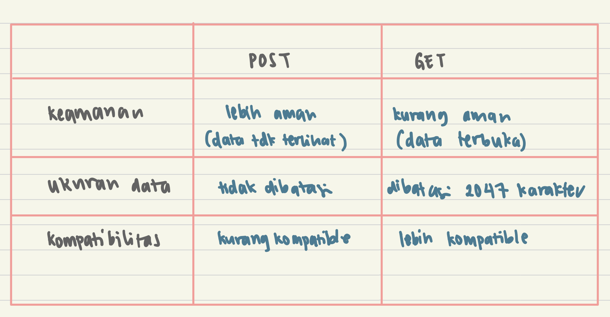
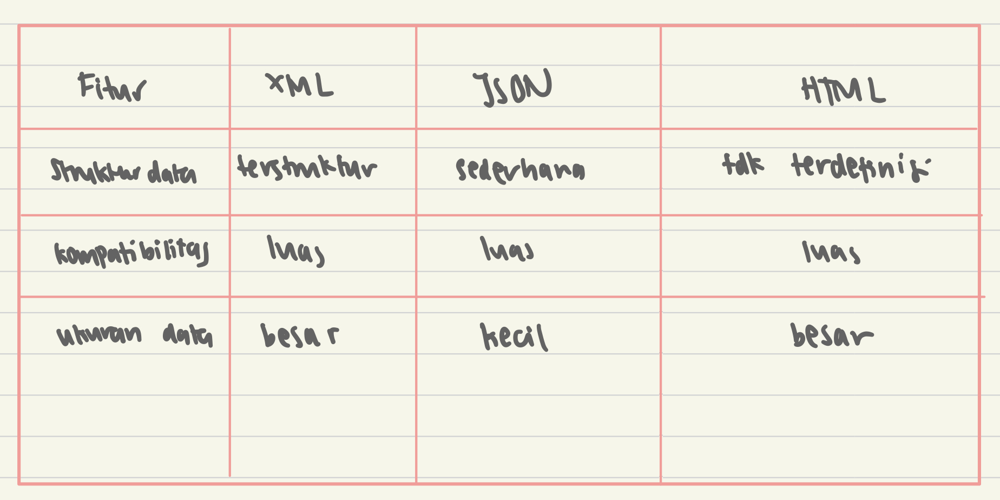

1.  Apa perbedaan antara form POST dan form GET dalam Django?

2.  Apa perbedaan utama antara XML, JSON, dan HTML dalam konteks pengiriman data?
XML sering digunakan untuk mengirimkan data yang kompleks, seperti data produk atau data transaksi. JSON sering digunakan untuk mengirimkan data yang sederhana, seperti data pengguna atau data konfigurasi. HTML sering digunakan untuk mengirimkan data yang bersifat visual, seperti data gambar atau data video.

3.  Mengapa JSON sering digunakan dalam pertukaran data antara aplikasi web modern?
JSON sering digunakan dalam pertukaran data antara aplikasi web modern karena memiliki beberapa kelebihan, antara lain:
- JSON memiliki struktur data yang sederhana, sehingga mudah dibaca dan ditulis.
- JSON biasanya memiliki ukuran data yang lebih kecil daripada XML, sehingga lebih cepat untuk dikirim dan diterima.
- JSON kompatibel dengan berbagai bahasa pemrograman dan perangkat lunak, sehingga mudah digunakan untuk mengembangkan aplikasi interaktif.
- JSON didukung dengan baik oleh JavaScript, yang merupakan bahasa pemrograman yang paling populer untuk mengembangkan aplikasi web modern.

4.  Jelaskan bagaimana cara kamu mengimplementasikan checklist di atas secara step-by-step (bukan hanya sekadar mengikuti tutorial).
- Membuat file forms.py di directory main dan membuat class ItemForm di file tersebut
- Membuat fungsi create_product di dalem file views.py untuk dapat menambahkan produk baru serta menambahkan path url untuk create_product di dalam file urls.py
- Menambahkan file create_product.html untuk dapat menambahkan product di web serta mengedit file main.html agar ada tampilan produk serta tombol add product
- Menambahkan fungsi show_xml, show_json, show_xml_by_id, dan show_json_by_id di file views.py
- Menambahkan path url untuk fungsi-fungsi yang baru saja dibuat di file urls.py

SS POSTMAN
1. HTML

2. XML

3. JSON

4. XML BY ID

5. JSON BY ID

